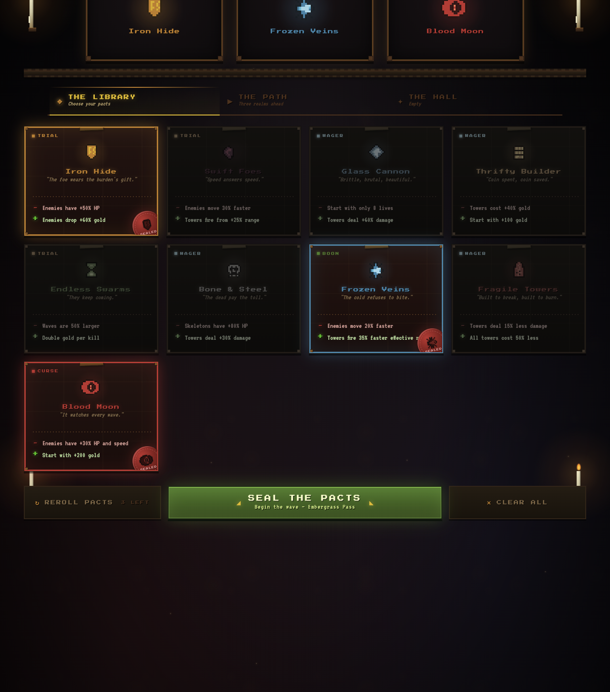
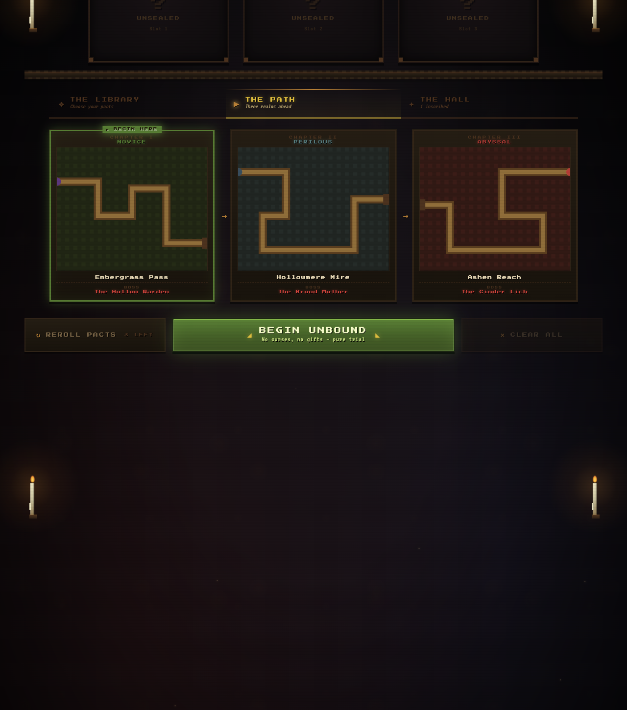
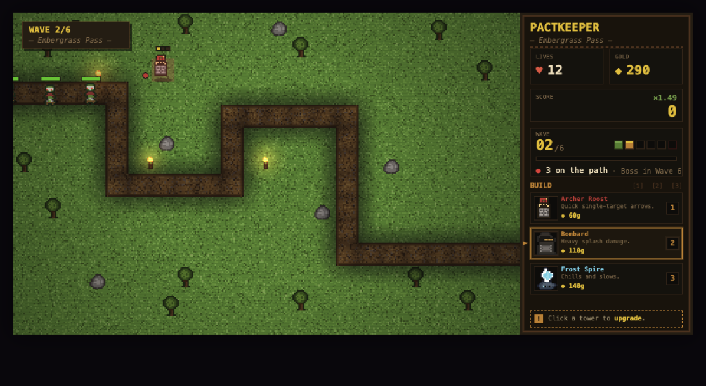
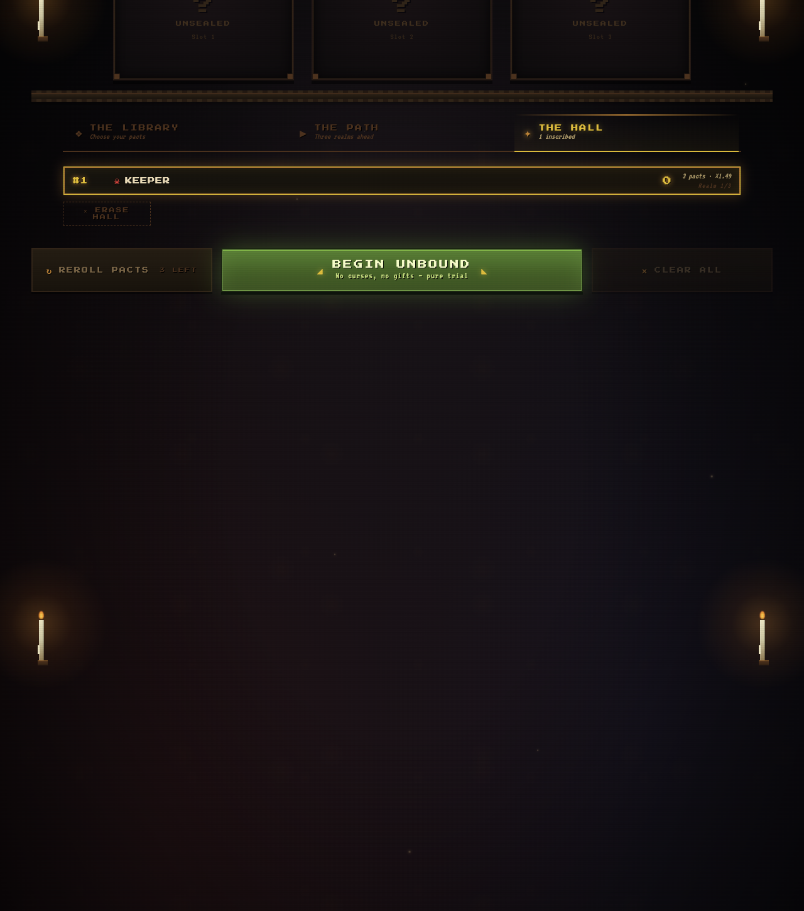

# Pactkeeper

A browser-based tower defense built in TypeScript + Vite. Choose up to three
**Pacts** — each a curse paired with a gift — then defend a fixed path through
six waves and a boss. Three realms, one campaign, and a leaderboard for
keepers who survive with the heaviest pacts sealed.

**Play it now: [pactkeeper.vercel.app](https://pactkeeper.vercel.app/)**



## Overview

Pactkeeper layers a deckbuilder-style modifier system on top of classic
tower defense. Before every realm you visit **The Library** and choose
which pacts to seal — `TRIAL`s curse the foe, `WAGER`s rebalance the
rules, `BOON`s tilt fate your way, and `CURSE`s bring catastrophic gifts.
Each pact you accept boosts your final score multiplier; refuse them
all to walk **Unbound** for the trial of pure skill.

- **Three realms.** Embergrass Pass (Novice) → Hollowmere Mire
  (Perilous) → Ashen Reach (Abyssal). Each realm is six waves of mixed
  goblins, skeletons, and orcs capped by a unique boss: the Hollow
  Warden, the Brood Mother, and the Cinder Lich.
- **Nine pacts.** From `Iron Hide` (enemies +50% HP, +60% gold drops)
  to `Glass Cannon` (start with 8 lives, towers deal +60% damage) to
  `Blood Moon` (enemies +30% HP/speed, start with +200 gold). The
  hardest combination compounds to a `×1.66` score multiplier.
- **Three towers, three tiers.** Archer Roost (single-target),
  Bombard (splash), and Frost Spire (chill & slow). Click any placed
  tower to open the upgrade popover.
- **Hall of Keepers.** Per-run scores are signed, persisted, and ranked
  in `THE HALL` tab. Final score combines kills, life bonus, and your
  sealed-pact multiplier.



## Gameplay



The play field is canvas-rendered pixel art with a DOM HUD on the right.
The first tower you place auto-kicks Wave 1; subsequent waves roll on a
short timer after the previous one clears. Boss arrives on Wave 6.

**Controls**

| Action | Input |
| --- | --- |
| Select Archer / Bombard / Frost | `1` / `2` / `3` (or click the build card) |
| Place tower | Click an empty grass tile |
| Open upgrade popover | Click a placed tower |
| Cancel selection | `Esc` |

## The Hall of Keepers

When a run ends — victory or defeat — you can inscribe your name. The Hall
stores the top 25 entries in `localStorage`, sorted by final score.



Scoring formula:

```
final = round((rawScore + livesLeft * LIFE_BONUS) * (1 + pactXp / 1000))
```

Per-kill points: goblin 10, skeleton 18, orc 28, boss 500. Realm-clear
bonus: 1000. Life bonus: 50/life remaining.

## Running locally

Requires Node 18+ and npm.

```bash
npm install
npm run dev      # http://localhost:5173 with live reload
npm run build    # typecheck + doc-check + vite production build
npm run preview  # serve the built bundle
```

`npm run build` is the canonical "is this still valid?" check. It runs
`tsc -b`, the registry-consistency doc-check, and a `vite build` in
sequence.

## Tech

- **TypeScript** (`strict`, `noUnusedLocals`, `noUnusedParameters`)
- **Vite 6** for the dev server and bundler
- Zero runtime dependencies — all rendering is hand-rolled canvas
  (gameplay) and CSS (pact screen, Hall, tower upgrade popover)
- 16×16 hand-authored pixel-art sprites scaled 2× at draw time

## Architecture

The pact selection screen and the play screen are intentionally
different rendering systems — CSS/DOM for the rune-and-candlelight
pact UI, pixel-perfect canvas for the play field. They swap via the
`hidden` attribute on two top-level stages.

For the full architecture (coordinate systems, registries, pairing
rules, known anomalies), see [`AGENTS.md`](AGENTS.md). Step-by-step
"add a tower / enemy / pact / wave" recipes live in
[`docs/recipes.md`](docs/recipes.md).
